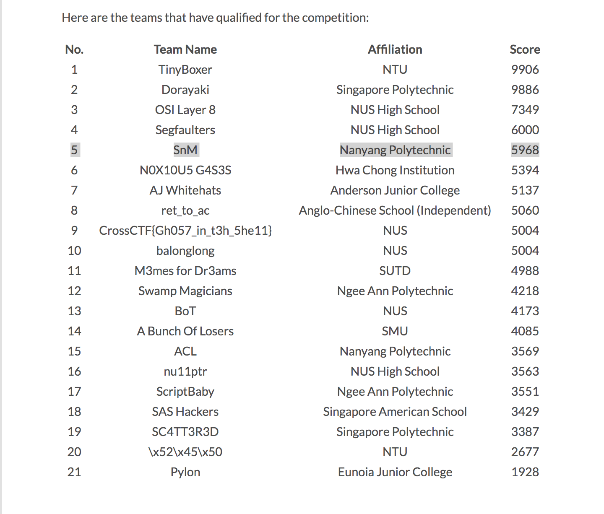

# CrossCTF 2018 Qualifiers Writeups

This is a collection of my writeups for challenges in the online qualifiers for [CrossCTF 2018](https://crossctf.dystopia.sg/team/4). 

## Time
	
	Qualifier will start at 1pm (UTC+08:00) on 19 May 2018 (Saturday).
	It will end at 1pm on 21 May (Monday) for a total of 48 hours.

## Description

	CrossCTF is a cyber security competition organized by NTU with collaboration with NUS Greyhats and SMU Whitehats. This also provides a platform for participants to hack safely in Singapore. The other reason is to promote Cyber Security Capture-The-Flag Compeitions in Singapore.

## Results

My team qualified with a score of 5968 (5th place)

	The following are the qualifying criteria:

	1. The threshold is is the median score (1928) out of all the teams
	2. Top 2 teams from their respective schools

## Solved
Challenge | Category | Remarks
----------|:--------:| -------
[Even Flow](./Solved/Even_Flow) | Pwn | 
[Real Baby Pwnable](./Solved/Real_Baby_Pwnable) | Pwn | 
[Lossy Oracle](./Solved/Lossy_Oracle) | Crypto | 
[Kryptonight 1](./Solved/Kryptonight_1) | Crypto | 
[Kryptonight 2](./Solved/Kryptonight_2) | Crypto | 
[BabyRSA](./Solved/BabyRSA) | Crypto |
[QuirkyScript 1](./Solved/QuirkyScript_1) | Web | 
[QuirkyScript 2](./Solved/QuirkyScript_2) | Web | 
[QuirkyScript 3](./Solved/QuirkyScript_3) | Web | 
[QuirkyScript 4](./Solved/QuirkyScript_4) | Web | 
[QuirkyScript 5](./Solved/QuirkyScript_5) | Web | 
[Baby Web](./Solved/Baby_Web) | Web | 
[Choose Your Own Adventure](./Solved/Choose_Your_Own_Adventure) | Misc |
[Sanity](./Solved/Sanity) | Sanity |

## Unsolved
Challenge | Category | Remarks
----------|:--------:| -------
[GoGoGo](./Unsolved/GoGoGo) | Reversing |
[BabyRSA 2](./Unsolved/BabyRSA_2) | Crypto | 
[Easynote](./Unsolved/Easynote) | Pwn | 
[Skipping Rope](./Unsolved/Skipping_Rope) | Pwn | 
[Quiet Moon](./Unsolved/Quiet_Moon) | Pwn | 
[Impossible Shellcoding](./Unsolved/Impossible_Shellcoding) | Pwn | 
[Blood Moon](./Unsolved/Blood_Moon) | Pwn | 
