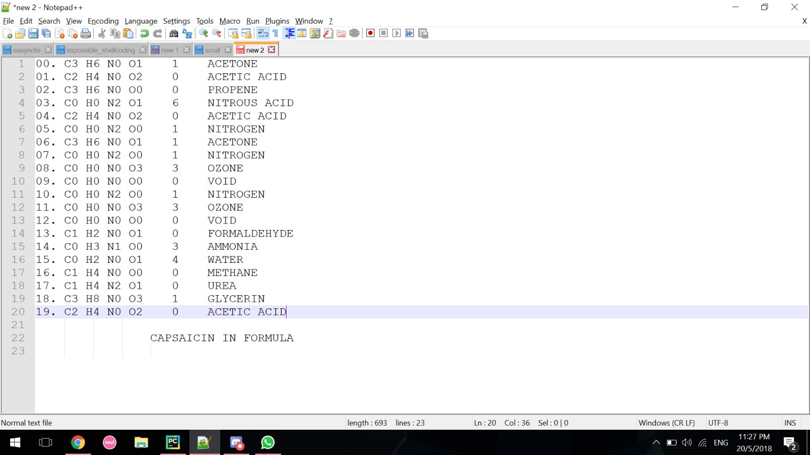

# Choose Your Own Adventure
Misc

## Challenge 
> Maybe your question was too long. You reduced the length of your question and asked the oracle again: "Where's the flag?"

> As expected, she had no _reaction_ again. You sigh... maybe the _solution_ really was in there after all. You close your eyes and started willing yourself back into the enemy's _base_...

> Non-standard flag format: [A-Z0-9]+

> nc ctf.pwn.sg 1400

### Hint 1:

> `len(flag) = 9`

>Think outside the box for this challenge. It's less of a ctf challenge and more of a misc puzzle tbh...

## Hint 2:

> Think about how the contents of each room relate to the coordinates and the score.

## Hint 3:

> So now that you can match why each object is in a specific room (with a certain coordinate and score), perhaps think about the scribblings. What's the meaning behind the scribbles?

## Hint 4:

> You are looking for a string of characters that leads to the final flag.

>Link each object in the rooms to the coordinates and figure out the overarching theme of the puzzle.

[See the official repo for the challenge binary](https://github.com/nnamon/crossctf-2018-challenges/tree/master/quals/challenges/adventure)

A really fun challenge, but solvable only if you are a little crazy... 

---

## Context
From the hints, we eventually find out that CYOA revolves around chemistry.

- Score represents (H)
- Coordinates being (C, O, N)

With that, we can derive an example for one of the rooms in floor 0.

	Score: 00
	Coordinates: (00 01 02)

This gives us N20 for laughing gas which corresponds to the description of the room provided

	Even though the room is empty, you chuckled at the absurdity as you entered it

---

So by traversing manually through all the rooms, the following is be collated.

| Floor | Room | Score | Description |
| ----- | ---- | ----- | ----------- |
| 00 | (00, 00) | 0 | Void
| 00 | (00, 01) | 3 | Egyption Statue
| 00 | (00, 02) | 0 | Suffocating Room
| 00 | (01, 00) | 2 | Thick Blanket of Fog
| 00 | (01, 02) | 0 | Empty room, Chuckled
| 00 | (02, 00) | 2 | Skin burns in puddle, Cleaner
| 00 | (03, 00) | 0 | Heat from deep blue tube lights
| - | - | - | - |
| 01 | (00, 00) | 4 | No naked flames
| 01 | (00, 01) | 1 | Spilled almond power
| 01 | (01, 00) | 2 | Taxidermized animals
| 01 | (01, 02) | 4 | Contribute to puddle of urine
| 01 | (03, 00) | 2 | Soft drinks erupt from holes
| - | - | - | - |
| 02 | (00, 00) | 4 | Sweet smell of rotting fruits
| 02 | (01, 00) | 6 | Deserted pub
| 02 | (02, 00) | 4 | Sour smell like gyoza
| 02 | (02, 01) | 5 | Microscopic creatures trying to thrive
| 02 | (03, 00) | 2 | Gradient of lard and starch
| - | - | - | - |
| 03 | (00, 00) | 6 | Pipes running out of salt cavern room, with large gas canisters
| 03 | (01, 00) | 6 | Paint drips down like wall crying
| 03 | (03, 00) | 8 | Bottles of hair gel and vape juice

## Solution

***Solved by my team member***

	Rooms in Floor 00
	=======
	(00, 00) - 0 = 0 
	(00, 01) - 1 = 3 NH3
	(00, 02) - 2 = 0 N2
	(01, 00) - 3 = 2 H2O
	(01, 02) - 4 = 0 N2O
	(02, 00) - 5 = 2 H2O2
	(03, 00) - 6 = 0 O3

	Rooms in Floor 01
	======
	(00, 00) - 7 = 4 CH4
	(00, 01) - 8 = 1 CHN
	(01, 00) - 9 = 2 H2CO
	(01, 02) - 10 = 4 CH4N2O
	(03, 00) - 11 = 2 H3CO3

	Rooms in Floor 02
	======
	(00, 00) - 12 = 4 C2H4
	(01, 00) - 13 = 6 C2H6O
	(02, 00) - 14 = 4 C2H4O2
	(02, 01) - 15 = 5 C2H5NO2
	(03, 00) - 16 = 2 C2H2O3

	Rooms in Floor 03
	======
	(00, 00) - 17 = 6 C3H6
	(01, 00) - 18 = 6 C3H6O
	(03, 00) - 19 = 8 C3H8O3

----

	00. C3 H6 N0 O1    1
	01. C2 H4 N0 O2    0
	02. C3 H6 N0 O0    0
	03. C0 H0 N2 O1    6
	04. C2 H4 N0 O2    0
	05. C0 H0 N2 O0    1
	06. C3 H6 N0 O1    1
	07. C0 H0 N2 O0    1
	08. C0 H0 N0 O3    3
	09. C0 H0 N0 O0    0
	10. C0 H0 N2 O0    1
	11. C0 H0 N0 O3    3
	12. C0 H0 N0 O0    0
	13. C1 H2 N0 O1    0
	14. C0 H3 N1 O0    3
	15. C0 H2 N0 O1    4
	16. C1 H4 N0 O0    0
	17. C1 H4 N2 O1    0
	18. C3 H8 N0 O3    1
	19. C2 H4 N0 O2    0

## Flag

	C18H27NO3
